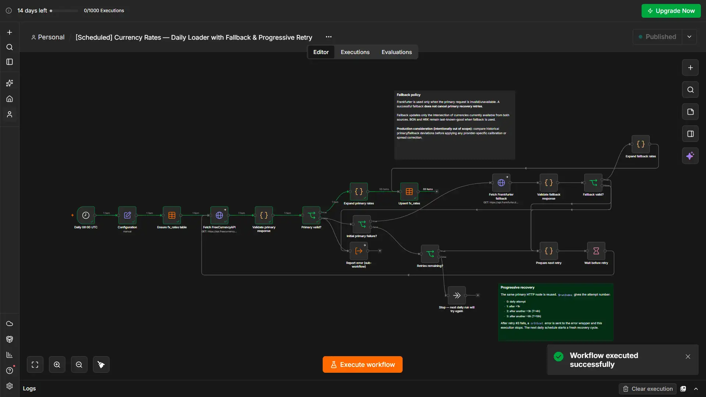
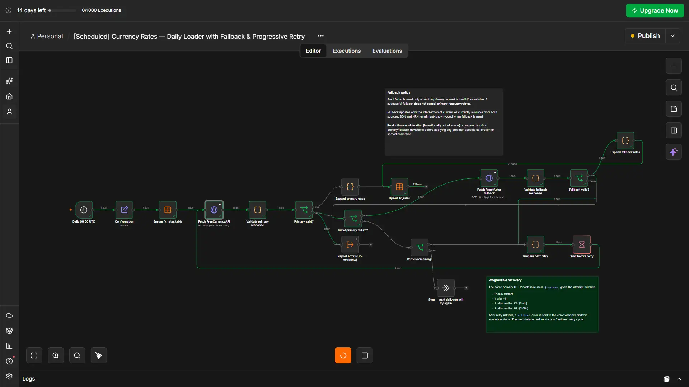
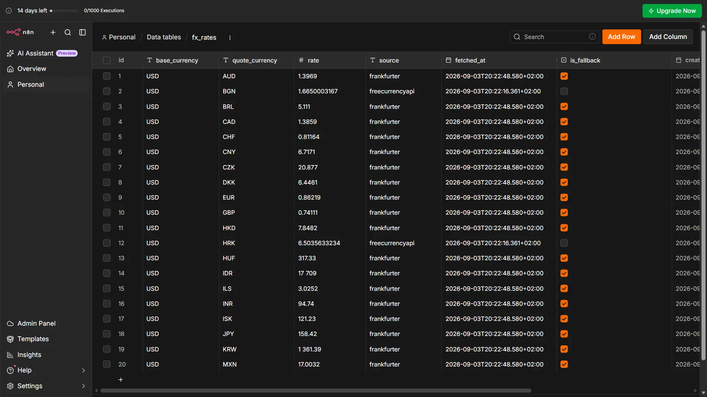

# Currency Converter — AI Automation Engineer Test Task

Implementation of the requested n8n currency-rate loader and AI currency-conversion agent.

## Project structure

The task defines two functional workflows. The implementation uses five n8n workflows to keep ingestion, deterministic conversion logic, and error handling separated.

### `Rates` folder

- `[Scheduled] Currency Rates — Daily Loader with Fallback & Progressive Retry`
- `[AI Chat Agent] Currency Converter`
- `[AI Tool] convert_currency`

### `System` folder

- `[_err] Error Reporter`
- `[_err] Global Error handler`

The two `[_err]` workflows are reusable infrastructure helpers, not additional business functionality.

## Environment

- **n8n:** Cloud
- **Primary FX provider:** FreeCurrencyAPI
- **Fallback FX provider:** Frankfurter
- **LLM provider:** Groq
- **Model:** `openai/gpt-oss-20b`

Groq is used on its free tier, so the implementation does not require a paid LLM plan and stays within the test-task constraints.

Credentials are stored in n8n Credentials and are not embedded in workflow logic.

## Data model

### `fx_rates`

| Field | Type | Purpose |
|---|---|---|
| `base_currency` | string | Configured base currency |
| `quote_currency` | string | Quote currency |
| `rate` | number | BASE → QUOTE rate |
| `source` | string | Rate provider |
| `fetched_at` | datetime | Fetch timestamp |
| `is_fallback` | boolean | Whether fallback data was used |

Rows are upserted by `(base_currency, quote_currency)`.

### `fx_error_log`

Stores normalized operational errors:

`occurred_at`, `workflow_name`, `execution_id`, `severity`, `provider`, `error_kind`, `stage`, `attempt`, `status_code`, `message`, `context`.

---

# Test Task Implementation Report

## Workflow 1 — Daily Currency Rate Loader

Implemented by:

`[Scheduled] Currency Rates — Daily Loader with Fallback & Progressive Retry`

| Requirement | Implementation |
|---|---|
| Run once per day | Schedule Trigger at **06:00 UTC** |
| FreeCurrencyAPI `/latest` | Primary rate source |
| Configurable base currency | `base_currency`, default `USD` |
| Store in n8n Data Table | `fx_rates` |
| Upsert existing currency pairs | Match by base + quote currency |
| Store rate and freshness | `rate`, `fetched_at` |
| External API failure handling | Validation, structured error reporting, fallback and retries |
| Partial response handling | Invalid/incomplete responses are rejected before writes |

The primary response is validated before any Data Table update. HTTP/transport errors, malformed responses, invalid rates, invalid base-rate identity, and partial responses cannot overwrite last-known-good data.

On initial FreeCurrencyAPI failure, Frankfurter is queried immediately as a fallback. Fallback data is validated independently before it can update the table.

A successful fallback does not cancel primary recovery. FreeCurrencyAPI is retried using:

`+1h → +3h → +6h`

After the third failed retry, the failure is reported as `critical` and the next daily run starts a fresh recovery cycle.

### Evidence

**Primary loading path**



**Fallback and recovery path**



**Stored rates**



---

## Workflow 2 — AI Chat Agent with Conversion Tool

Implemented by:

`[AI Chat Agent] Currency Converter`

with deterministic tool:

`[AI Tool] convert_currency`

The chat uses n8n native Chat Trigger, Groq and conversation memory. The LLM interprets user language and conversational intent; it does not calculate or invent FX rates.

### Tool contract

```text
convert_currency(
  amount: number,
  from_currency: string,
  to_currency: string
)
```

The tool validates input, reads `fx_rates`, finds a common stored base currency, calculates the conversion deterministically, and returns the converted amount together with rate freshness and provider metadata.

For rates stored as `BASE → QUOTE`:

```text
rate(from → to) = rate(BASE → to) / rate(BASE → from)
converted = amount × rate(from → to)
```

When two component rates are required, the returned `fetched_at` is the older timestamp because the result depends on both values.

| Requirement | Implementation |
|---|---|
| Native n8n chat | Chat Trigger / hosted chat |
| LLM | Groq free tier, `openai/gpt-oss-20b` |
| Custom conversion tool | Separate deterministic workflow |
| `amount`, `from_currency`, `to_currency` | Typed workflow inputs |
| Natural-language queries | AI Agent |
| Follow-up questions | Conversation Memory |
| Rate freshness | `fetched_at` returned by tool and displayed in human-readable form |
| Unknown currency | Deterministic validation + plain-language agent response |
| Missing rate data | Deterministic validation + plain-language agent response |
| Zero/negative amount | Rejected |
| Non-numeric input | Handled gracefully |
| Raw errors hidden | Agent localizes and explains tool errors |

The agent always calls `convert_currency` for conversions and rate requests. It preserves conversion context across follow-ups but detects response language independently from each current user message.

Successful answers stay concise while still exposing freshness, for example:

```text
55.56 TRY (rates updated today at 9:35 AM)
```

The full system prompt is configured directly in the AI Agent workflow. It is not duplicated here; its key constraints are deterministic tool usage, no model-internal FX rates, per-message language detection, localized error handling, follow-up context, and mandatory human-readable freshness.

### Evidence

[**Watch the AI Agent demo video (MP4)**](evidence/ai-agent-demo.mp4)

The demo includes the chat greeting, multilingual requests, an error path, and a successful follow-up that reuses conversion context from the preceding message.

---

# Additional engineering decisions

These are beyond the minimum functional requirements of the test task.

### Frankfurter fallback

Provides usable current rates during a temporary FreeCurrencyAPI outage.

### Progressive primary recovery

Fallback continuity and primary recovery are treated as separate concerns, so successful fallback does not stop later FreeCurrencyAPI retries.

### Last-known-good protection

No provider response is written until it passes validation.

### Reusable error handling

Expected provider failures are sent to `[_err] Error Reporter`. Unexpected n8n execution failures can be routed through `[_err] Global Error handler` into the same normalized error pipeline.

Notification delivery is intentionally provider-agnostic so email, Slack, Telegram, or an incident-management system can be attached later without changing business workflows.

### Deterministic conversion workflow

All FX arithmetic is kept outside the LLM. This makes calculations reproducible and prevents hallucinated rates.

### Cross-rate support

The table does not need every possible direct pair. Supported currencies can be converted through their common configured base.

### Conservative freshness

Cross-rate freshness uses the older of the component timestamps.

### Multilingual behavior

Conversation memory preserves conversion context, while response language is evaluated independently for every current user message.

### Provider calibration intentionally omitted

Different FX providers may have systematic methodology or timing differences. Historical comparison/calibration could be added in a production pricing system, but it was intentionally left outside the scope of this test task.
